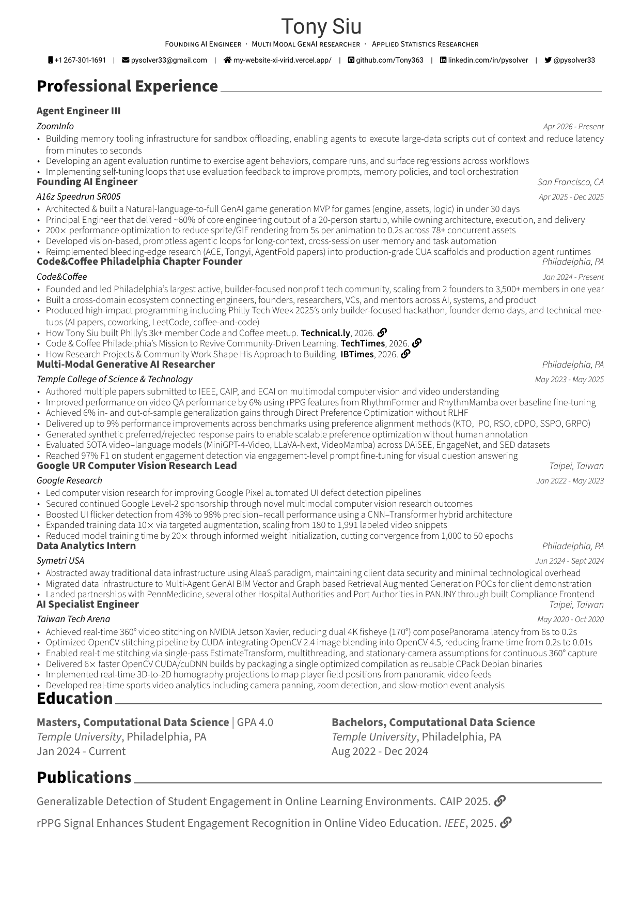

# Tony Siu - Resume

One-page LaTeX resume built with a custom document class derived from Awesome-CV.

Current version highlights Tony's Agent Engineer III role at ZoomInfo, with experience in agent memory tooling infrastructure, agent evaluation runtimes, and self-tuning loops.

## Preview



## Download

[Download PDF](resume.pdf)

## Project Structure

```
.
├── resume.tex              # Main document (personal info, section imports)
├── russell.cls             # Custom document class (styles, environments)
├── resume.pdf              # Compiled resume
├── profile.png             # Profile photo
├── resume_preview-1.png    # Resume preview
├── resume_preview-2.png    # Archived resume preview
├── CLAUDE.md               # Claude Code project instructions
├── cv/                     # Section content files
│   ├── achievements.tex
│   ├── education.tex
│   ├── experience.tex
│   ├── interests.tex
│   ├── languages.tex
│   ├── publications.tex
│   ├── references.bib
│   ├── research_projects.tex
│   ├── skills.tex
│   ├── summary.tex
│   └── volunteering.tex
└── fonts/                  # Roboto and FontAwesome fonts
```

## Active Sections

Currently enabled in `resume.tex`:
- Experience
- Education
- Publications

To enable/disable sections, comment or uncomment `\input{cv/...}` lines in `resume.tex`.

## Build

Requires XeLaTeX and Biber:

```bash
xelatex resume.tex
biber resume
xelatex resume.tex
```

Or single compile (without bibliography):

```bash
xelatex resume.tex
```

## Customization

### Colors

Set accent color in `resume.tex`:
```latex
\definecolor{russell}{HTML}{000000}
```

### Margins

Adjust page margins via `\geometry{}`:
```latex
\geometry{left=1.2cm, top=0.6cm, right=1.2cm, bottom=1.0cm, footskip=.3cm}
```

### CV Environments

- `\cventry{position}{title}{location}{date}{description}` - Work/education entries
- `\cvskill{category}{skills}` - Skills listing
- `\cvhonor{position}{title}{location}{date}` - Awards/honors
- `cvitems` environment - Bullet points within entries

## Requirements

- XeLaTeX or LuaLaTeX
- Biber (for bibliography)
- Roboto font family (included in `fonts/`)
- FontAwesome5
